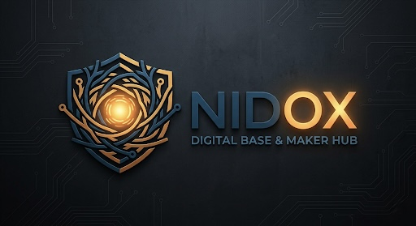

# 🔴 ВАЖНО / IMPORTANT

> **🔴 ВАЖНО**  
> Для корректной работы этого skill рекомендуется использовать аудит-модуль:  
> [`nidox-vpn-detection-defense-skill`](https://github.com/JonesPitkin/nidox-vpn-detection-defense-skill)
>
> Без него проверка конфигураций, маршрутизации, CDN, DNS и VPN-детекта может быть неполной.
>
> **🔴 IMPORTANT**  
> For proper operation of this skill it is strongly recommended to use:  
> [`nidox-vpn-detection-defense-skill`](https://github.com/JonesPitkin/nidox-vpn-detection-defense-skill)
>
> Without it, validation of VPN configurations, routing, CDN, DNS and detection-resistance settings may be incomplete.

  

<h1 align="center">🚀 Nidox VPN Skills</h1>

Коллекция навыков Codex для VPN-инфраструктуры, маршрутизации и устойчивых к блокировкам сетевых решений.

Nidox VPN Skills

Коллекция навыков Codex для проектирования, настройки и сопровождения VPN-инфраструктуры.

Репозиторий содержит как готовые навыки, так и собственные разработки для работы с современными инструментами обхода блокировок, маршрутизации и сетевой инфраструктуры.

Список навыков

3x-ui-vps

Навык для работы с панелью 3x-ui и VPS-серверами.

Возможности:

* установка и обновление 3x-ui;
* настройка VLESS и Reality;
* работа с подписками;
* интеграция с Cloudflare;
* диагностика подключений;
* обслуживание VPN-серверов.

censorship-resistant-networking

Навык для проектирования устойчивых к блокировкам сетей.

Возможности:

* проектирование VPN-инфраструктуры;
* настройка Xray и Sing-box;
* использование Reality, XHTTP и WebSocket;
* работа с Cloudflare CDN и WARP;
* настройка HAProxy;
* маршрутизация и DNS;
* диагностика сетевых проблем;
* повышение устойчивости к блокировкам.

Планируемые навыки

* podkop-openwrt
* remnawave-admin
* cloudflare-proxy
* sing-box-admin
* xray-admin

Автор

Личная коллекция навыков проекта Nidox.
