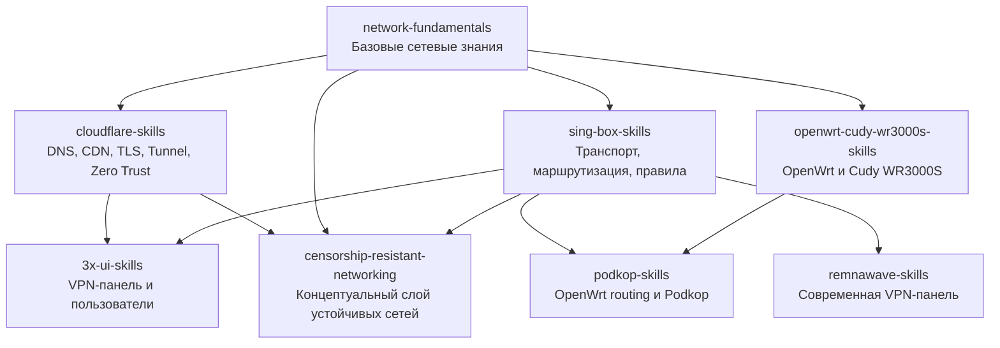

# NIDOX VPN Skills


> Русскоязычная база навыков для Codex по сетям, VPN-инфраструктуре, OpenWrt, Cloudflare, sing-box, 3x-ui, Podkop, Remnawave и homelab.


`nidox-vpn-skills` — мета-репозиторий и единая точка входа для NIDOX skill-пакетов, связанных с проектированием, публикацией, настройкой и сопровождением современной VPN-инфраструктуры.

Current release: `v1.0.0` — `NIDOX VPN Skills Foundation`

## Что входит в репозиторий

- `network-fundamentals` — базовый слой сетевых знаний.
- `cloudflare-skills` — DNS, CDN, TLS, Tunnel, Zero Trust и edge-публикация.
- `openwrt-cudy-wr3000s-skills` — OpenWrt и эксплуатация роутеров на базе Cudy WR3000S.
- `sing-box-skills` — транспорты, маршрутизация, DNS и policy logic.
- `3x-ui-skills` — панель управления VPN-пользователями и Xray-инфраструктурой.
- `remnawave-skills` — современная VPN-панель и рабочие сценарии эксплуатации.
- `podkop-skills` — OpenWrt routing и интеграция Podkop.
- `censorship-resistant-networking` — концептуальный слой устойчивых к блокировкам сетей.

Репозиторий фиксирует общую структуру навыков, правила навигации и единые требования к аудиту. Основной рабочей моделью остаются самостоятельные skill-репозитории и верхнеуровневые пакеты без legacy-обёртки `skills/`.

## Skill Dependency Map



Диаграмма показывает базовые концептуальные зависимости между пакетами. `network-fundamentals` выступает фундаментом, а `sing-box-skills` и `cloudflare-skills` формируют ключевой слой для более прикладных VPN и OpenWrt-сценариев.

## Статусы skill-пакетов

| Skill Package | Роль | Статус | Примечание |
| --- | --- | --- | --- |
| `network-fundamentals` | Базовая сеть и диагностика | Stable | Фундамент для остальных skill-пакетов |
| `cloudflare-skills` | Публикация, DNS, TLS, Tunnel | In Progress | Расширение edge и integration-сценариев |
| `openwrt-cudy-wr3000s-skills` | OpenWrt и Cudy WR3000S | In Progress | Углубление install/recovery/routing-практик |
| `sing-box-skills` | Транспорты, DNS, маршрутизация | In Progress | Расширение routing и transport matrix |
| `3x-ui-skills` | Xray/VLESS panel operations | Stable | Базовый пакет после `v1.0.0` |
| `remnawave-skills` | Современная VPN-панель | In Progress | Развитие production- и migration-сценариев |
| `podkop-skills` | OpenWrt routing и Podkop | Stable | Базовый пакет после `v1.0.0` |
| `censorship-resistant-networking` | Архитектурный слой устойчивых сетей | Incubating | Концептуальный пакет для `v1.1+` |

Все skill-пакеты внутри `nidox-vpn-skills` должны проходить аудит через `nidox-vpn-detection-defense-skill`, когда используются как часть общей VPN-системы репозитория.

## Roadmap

### v1.1

- Довести `cloudflare-skills`, `sing-box-skills` и `openwrt-cudy-wr3000s-skills` до более полной operational-документации.
- Расширить `remnawave-skills` production-сценариями, migration notes и практиками обслуживания.
- Упорядочить cross-links между пакетами, чтобы навигация по зависимостям была линейной и предсказуемой.
- Формализовать `censorship-resistant-networking` как поддерживаемый концептуальный слой для сложных anti-censorship topology decisions.

### v2.0

- Добавить новые skill-направления для `Xray Core`, `VPS Infrastructure`, `GeoIP / ASN Strategy` и `VPN Detection Research`.
- Сформировать более зрелую knowledge graph-модель между пакетами, аудитом и deployment-сценариями.
- Подготовить единый production-grade meta-index для router, panel, transport, DNS и edge-публикации.
- Довести репозиторий до состояния полного reference-hub для русскоязычной VPN и homelab-экспертизы под Codex.

## Быстрая навигация

- [NIDOX_SKILLS_INDEX.md](./NIDOX_SKILLS_INDEX.md) — главный индекс всех навыков репозитория.
- [CHANGELOG.md](./CHANGELOG.md) — история релизов и изменений репозитория.
- [SKILL_INDEX.md](./SKILL_INDEX.md) — центральный каталог VPN Skills со статусами и требованиями к аудиту.
- [AUDIT_POLICY.md](./AUDIT_POLICY.md) — правила обязательного аудита skills внутри `nidox-vpn-skills`.
- [REPOSITORY_POLICY.md](./REPOSITORY_POLICY.md) — разграничение ролей главного репозитория и самостоятельных skill-репозиториев.
- [ROADMAP.md](./ROADMAP.md) — план развития текущих и будущих VPN Skills.
- [CONTRIBUTING.md](./CONTRIBUTING.md) — требования к структуре и включению новых skills.
- [network-fundamentals/](./network-fundamentals/) — встроенный фундаментальный skill по сетям.

`NIDOX_SKILLS_INDEX.md` является главным индексом всех навыков репозитория.

## Структура репозитория

```text
nidox-vpn-skills/
├── README.md
├── NIDOX_SKILLS_INDEX.md
├── AUDIT_POLICY.md
├── REPOSITORY_POLICY.md
├── SKILL_INDEX.md
├── ROADMAP.md
├── CONTRIBUTING.md
├── LICENSE
├── .gitignore
├── network-fundamentals/
│   ├── README.md
│   ├── SKILL.md
│   ├── AUDIT.md
│   ├── QUALITY_REPORT.md
│   ├── references/
│   └── ...
├── archive/
│   ├── macOS/
│   ├── packages/
│   └── README.md
├── 3x-ui-skills/
│   ├── README.md
│   ├── SKILL_INDEX.md
│   ├── VERSION_MATRIX.md
│   ├── MIGRATION_GUIDE.md
│   └── ...
├── podkop-skills/
│   ├── README.md
│   ├── SKILL_INDEX.md
│   ├── VERSION_MATRIX.md
│   ├── MIGRATION_GUIDE.md
│   └── ...
├── cloudflare-skills/
│   ├── README.md
│   ├── LICENSE
│   ├── cloudflare-basics/
│   ├── cloudflare-dns/
│   ├── cloudflare-ssl-tls/
│   ├── cloudflare-proxy-cdn/
│   ├── cloudflare-tunnel/
│   ├── cloudflare-zero-trust/
│   ├── cloudflare-security/
│   ├── cloudflare-vpn-integration/
│   └── ...
├── remnawave-skills/
│   ├── README.md
│   ├── SKILL_INDEX.md
│   ├── VERSION_MATRIX.md
│   ├── MIGRATION_GUIDE.md
│   └── ...
├── openwrt-cudy-wr3000s-skills/
│   ├── README.md
│   ├── SKILL_INDEX.md
│   ├── VERSION_MATRIX.md
│   ├── MIGRATION_GUIDE.md
│   └── ...
├── sing-box-skills/
│   ├── README.md
│   ├── SKILL_INDEX.md
│   ├── VERSION_MATRIX.md
│   ├── MIGRATION_GUIDE.md
│   └── ...
└── audit/
    └── nidox-vpn-detection-defense-skill.md
```

Legacy-каталог `skills/` удалён из активной структуры репозитория после переноса к самостоятельным skill-репозиториям и верхнеуровневым пакетам.

## Политика аудита

Все skills внутри `nidox-vpn-skills` должны проверяться через `nidox-vpn-detection-defense-skill`.

Это обязательное правило действует именно для данного мета-репозитория, потому что здесь навыки рассматриваются как части одной VPN-системы, а не как полностью изолированные модули. Аудит нужен для проверки:

- VPN detection risks
- network fingerprints
- routing artifacts
- GeoIP / ASN exposure
- DNS leaks
- false-positive detection scenarios

Подробные правила описаны в файле [AUDIT_POLICY.md](./AUDIT_POLICY.md).

Общая роль главного репозитория и границы между мета-репозиторием и отдельными skill-репозиториями дополнительно описаны в файле [REPOSITORY_POLICY.md](./REPOSITORY_POLICY.md).

## Network Fundamentals

В репозиторий добавлен отдельный фундаментальный skill по компьютерным сетям:

- встроенная версия: [network-fundamentals/](./network-fundamentals/)
- самостоятельный репозиторий: [network-fundamentals-skill](https://github.com/JonesPitkin/network-fundamentals-skill)

Раздел предназначен для общей сетевой теории и практической диагностики: OSI, TCP/IP, TCP и UDP, MTU и MSS, NAT и CGNAT, routing, gateway, DNS, IPv4, IPv6 и порты.

`network-fundamentals-skill` является обязательной базовой зависимостью для:

- `sing-box-skills`
- `podkop-skills`
- `3x-ui-skills`
- `remnawave-skills`
- `cloudflare-skills`
- `openwrt-cudy-wr3000s-skills`
- `nidox-vpn-detection-defense-skill`

## Связанные репозитории

- `3x-ui-skills` — самостоятельный репозиторий навыков для 3x-ui.
- `podkop-skills` — самостоятельный репозиторий навыков для Podkop.
- `cloudflare-skills` — самостоятельный репозиторий навыков для Cloudflare-публикации VPN-инфраструктуры.
- `openwrt-cudy-wr3000s-skills` — самостоятельный репозиторий навыков для OpenWrt / Cudy WR3000S.
- `sing-box-skills` — самостоятельный репозиторий навыков для sing-box.
- `remnawave-skills` — самостоятельный репозиторий навыков для Remnawave.
- [`network-fundamentals-skill`](https://github.com/JonesPitkin/network-fundamentals-skill) — самостоятельный репозиторий фундаментального сетевого справочника для Codex.
- `nidox-vpn-detection-defense-skill` — отдельный аудит-модуль для проверки VPN skills.

Отдельные репозитории могут использоваться сами по себе без обязательного аудита. Обязательная проверка через `nidox-vpn-detection-defense-skill` включается в тот момент, когда skill используется внутри `nidox-vpn-skills`.

При этом `network-fundamentals-skill` рассматривается как обязательный базовый слой знаний для всех перечисленных VPN-репозиториев и аудит-модуля.

## License

Репозиторий лицензирован по лицензии MIT. Материалы можно свободно использовать, изменять и распространять в соответствии с условиями лицензии MIT.

Полный текст лицензии: [LICENSE](./LICENSE)
