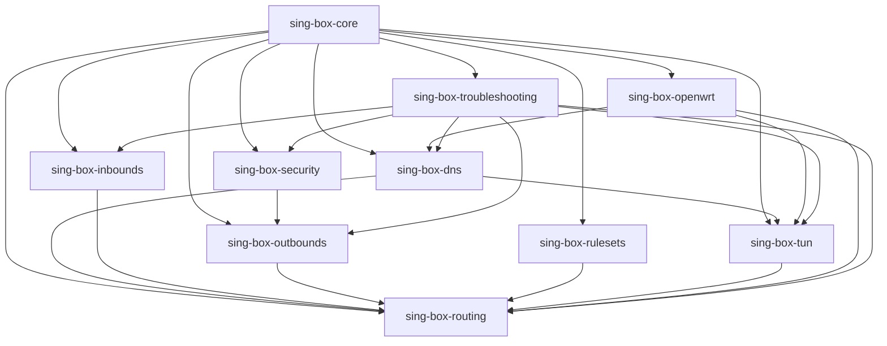

# sing-box-skills

Comprehensive AI Skill Repository for sing-box.

Official documentation based knowledge base for sing-box, DNS, Routing, TUN, Rule Sets, Security, OpenWrt, Podkop, VPS and Linux Server deployments.


## Overview

`sing-box-skills` is a production-oriented repository of AI skills, engineering playbooks and migration-aware reference materials for `sing-box`.

The repository is designed for:

- AI agents that must reason safely about `sing-box`;
- Codex skills and internal automation;
- engineers operating Linux, VPS and OpenWrt deployments;
- client, server, router and gateway use cases;
- version migrations and incident response.

Core repository goals:

- use only official `sing-box` documentation and official SagerNet resources;
- keep a stable production baseline on `sing-box v1.13.13`;
- provide reusable skills for architecture, DNS, routing, TUN, security and troubleshooting;
- avoid obsolete guidance such as recommending `GeoSite` and `GeoIP` for new configurations;
- separate stable production guidance from `1.14` alpha-era official documentation.

## Warning

Always use current official `sing-box` documentation and official SagerNet repositories.

Version warning:

- this repository treats `v1.13.13` as the stable production baseline;
- official `main` documentation already contains `1.14` alpha-line material;
- `1.14` documentation must not be used as the default truth for `1.13` production deployments;
- when stable and alpha docs differ, prefer the stable line unless the target deployment is explicitly testing alpha features.

## Official Sources

- Configuration: [sing-box.sagernet.org/configuration](https://sing-box.sagernet.org/configuration/)
- Migration: [sing-box.sagernet.org/migration](https://sing-box.sagernet.org/migration/)
- Deprecated: [sing-box.sagernet.org/deprecated](https://sing-box.sagernet.org/deprecated/)
- Changelog: [sing-box.sagernet.org/changelog](https://sing-box.sagernet.org/changelog/)
- Main repository: [github.com/SagerNet/sing-box](https://github.com/SagerNet/sing-box)
- Releases: [github.com/SagerNet/sing-box/releases](https://github.com/SagerNet/sing-box/releases)
- sing-geosite repository: [github.com/SagerNet/sing-geosite](https://github.com/SagerNet/sing-geosite)

## Repository Tree

```text
sing-box-skills/
├── README.md
├── LICENSE
├── CHANGELOG.md
├── CONTRIBUTING.md
├── GITHUB_REPOSITORY.md
├── SKILL_INDEX.md
├── VERSION_MATRIX.md
├── MIGRATION_GUIDE.md
├── RELEASE_v1.0.0.md
├── .gitignore
├── sing-box-core/
│   ├── SKILL.md
│   ├── agents/
│   └── references/
├── sing-box-dns/
│   ├── SKILL.md
│   ├── agents/
│   └── references/
├── sing-box-inbounds/
│   ├── SKILL.md
│   ├── agents/
│   └── references/
├── sing-box-outbounds/
│   ├── SKILL.md
│   ├── agents/
│   └── references/
├── sing-box-routing/
│   ├── SKILL.md
│   ├── agents/
│   └── references/
├── sing-box-tun/
│   ├── SKILL.md
│   ├── agents/
│   └── references/
├── sing-box-rulesets/
│   ├── SKILL.md
│   ├── agents/
│   └── references/
├── sing-box-security/
│   ├── SKILL.md
│   ├── agents/
│   └── references/
├── sing-box-openwrt/
│   ├── SKILL.md
│   ├── agents/
│   └── references/
└── sing-box-troubleshooting/
    ├── SKILL.md
    ├── agents/
    └── references/
```

## Skill Tree

- `sing-box-core`
  Architecture, root configuration model, version baseline, lifecycle and rollout discipline.
- `sing-box-dns`
  DNS topology, DoH, DoT, FakeIP, split DNS, `domain_resolver` and anti-leak patterns.
- `sing-box-inbounds`
  `mixed`, `socks`, `http`, `tun`, `redirect`, `tproxy` and `direct` inbound models.
- `sing-box-outbounds`
  `direct`, `block`, `dns`, modern proxy transports, groups and WireGuard endpoint thinking.
- `sing-box-routing`
  `route.rules`, `rule_set`, selective routing, split tunneling and final outbound policy.
- `sing-box-tun`
  TUN, `auto_route`, `auto_redirect`, transparent capture and safety exclusions.
- `sing-box-rulesets`
  inline, local and remote `rule_set` assets plus migration away from geo legacy.
- `sing-box-security`
  TLS, certificates, REALITY, migration-aware security review and trust validation.
- `sing-box-openwrt`
  OpenWrt package path, `procd`, router policy design and transparent rollout safety.
- `sing-box-troubleshooting`
  layer-by-layer diagnostics, incident playbooks and rollback-safe recovery.

## Dependency Map



## Quick Start

### 1. Pick the right skill

Use [SKILL_INDEX.md](./SKILL_INDEX.md) to map the task to the correct skill.

Recommended entry points:

- architecture and repo-wide review: `sing-box-core`
- DNS design or DNS leak analysis: `sing-box-dns`
- transparent client and TUN rollout: `sing-box-tun`
- route policy and `rule_set`: `sing-box-routing`
- TLS, REALITY and security review: `sing-box-security`
- OpenWrt and router deployment: `sing-box-openwrt`
- incident response: `sing-box-troubleshooting`

### 2. Confirm the version baseline

Read [VERSION_MATRIX.md](./VERSION_MATRIX.md) before reusing old configs or mixing stable and alpha docs.

### 3. Review migration impact

Read [MIGRATION_GUIDE.md](./MIGRATION_GUIDE.md) when moving between `1.10`, `1.11`, `1.12`, `1.13` and future `1.14`.

### 4. Open the target skill

Every production skill contains:

- official source map;
- architecture and design guidance;
- real JSON examples;
- OpenWrt, Linux Server, VPS and sing-box-compatible scenarios;
- `Common Mistakes`;
- `Troubleshooting`;
- `Best Practices`;
- `Version Compatibility`.

## Supported Versions

| Version | Status in This Repository | Notes |
|---|---|---|
| `1.10` | migration-supported legacy baseline | older root structure, geo and TUN cleanup required |
| `1.11` | migration-supported legacy baseline | `endpoints` appear, WireGuard outbound already deprecated |
| `1.12` | major migration boundary | `certificate`, `services`, DNS and ECH migration pressure |
| `1.13.13` | stable production baseline | default target for repository guidance |
| `1.14 alpha` | forward-looking only | official future path, not default production truth |

See [VERSION_MATRIX.md](./VERSION_MATRIX.md) for the full matrix.

## Compatibility Boundaries

This repository intentionally stays inside official `sing-box` knowledge boundaries.

That means:

- Podkop, 3x-ui and similar systems are covered only through sing-box-compatible concepts;
- UI-specific or undocumented behavior is not treated as canonical;
- other projects should be reviewed against their own official documentation separately.

## Repository Metadata

Prepared GitHub publication metadata is documented in [GITHUB_REPOSITORY.md](./GITHUB_REPOSITORY.md).

Intended publication settings:

- repository name: `sing-box-skills`
- visibility: `public`
- description: `AI Skill Repository for sing-box based on official documentation and official SagerNet resources.`

## License

This repository is distributed under the MIT License.

See [LICENSE](./LICENSE).

## Contribution Guide

See [CONTRIBUTING.md](./CONTRIBUTING.md).

Contribution rules in short:

- use only official `sing-box` docs and official SagerNet repositories;
- do not add guidance based on blog posts, chats or folklore;
- do not reintroduce `GeoSite` or `GeoIP` as recommended paths for new configs;
- clearly distinguish stable guidance from alpha or future-doc guidance;
- prefer production-safe examples over speculative ones.

## Changelog

See [CHANGELOG.md](./CHANGELOG.md).

Latest repository milestone:

- created the initial `sing-box-skills` repository structure;
- added production-oriented skills for architecture, DNS, inbounds, outbounds, routing, TUN, rule sets, security, OpenWrt and troubleshooting;
- added [SKILL_INDEX.md](./SKILL_INDEX.md), [VERSION_MATRIX.md](./VERSION_MATRIX.md) and [MIGRATION_GUIDE.md](./MIGRATION_GUIDE.md);
- fixed the repository baseline on stable `v1.13.13`;
- separated stable guidance from `1.14` alpha-era official docs.

